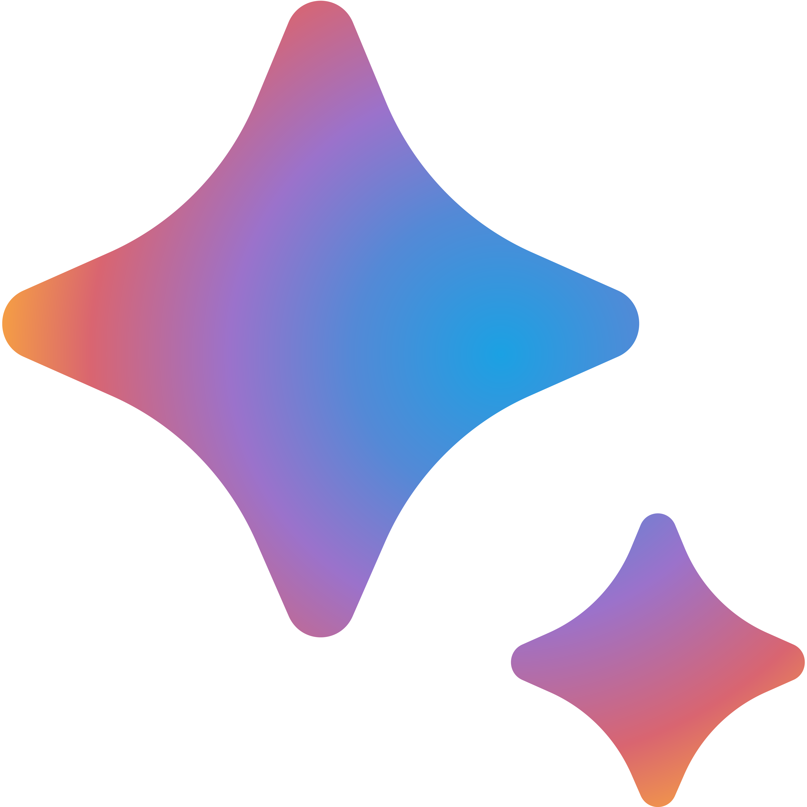

# Google Bard Desktop App

[](https://github.com/mantreshkhurana/Google-Bard-electron)

This is a desktop app for [Google Bard](https://bard.google.com/), a chatbot that uses GPT-3 to have conversations with you.


## Downloads

- [Windows (90 MB)](https://github.com/mantreshkhurana/Google-Bard-electron/releases/download/1.0.0/Google-Bard-v1.0.0-windows.zip)
- [macOS (84 MB)](https://github.com/mantreshkhurana/Google-Bard-electron/releases/download/1.0.0/Google-Bard-v1.0.0-darwin.zip)
- [Linux (66 MB)](https://github.com/mantreshkhurana/Google-Bard-electron/releases/download/1.0.0/Google-Bard-v1.0.0-linux.tar.xz)

## Releases

- [Latest Release](https://github.com/mantreshkhurana/Google-Bard-electron/releases)

## Installation

```bash
git clone https://github.com/mantreshkhurana/Google-Bard-electron.git
cd Google-Bard-electron
npm install
```

## Run

```bash
npm start
```

## Build

Binary files for Windows, Linux and Mac are available in the `release-builds/` folder.

### For Windows

```bash
npm run package-win
```

### For Linux

```bash
npm run package-linux
```

### For Mac

```bash
npm run package-mac
```

## Credits

- [Google Bard](https://bard.google.com/)
